<div align="center">

# 🏔️ ChitralSafe AI

### AI-powered community hazard reporting for Chitral, Pakistan

**Track: Disaster Management & Community Safety**

[](https://chitral-safe-ai.vercel.app)


<br>

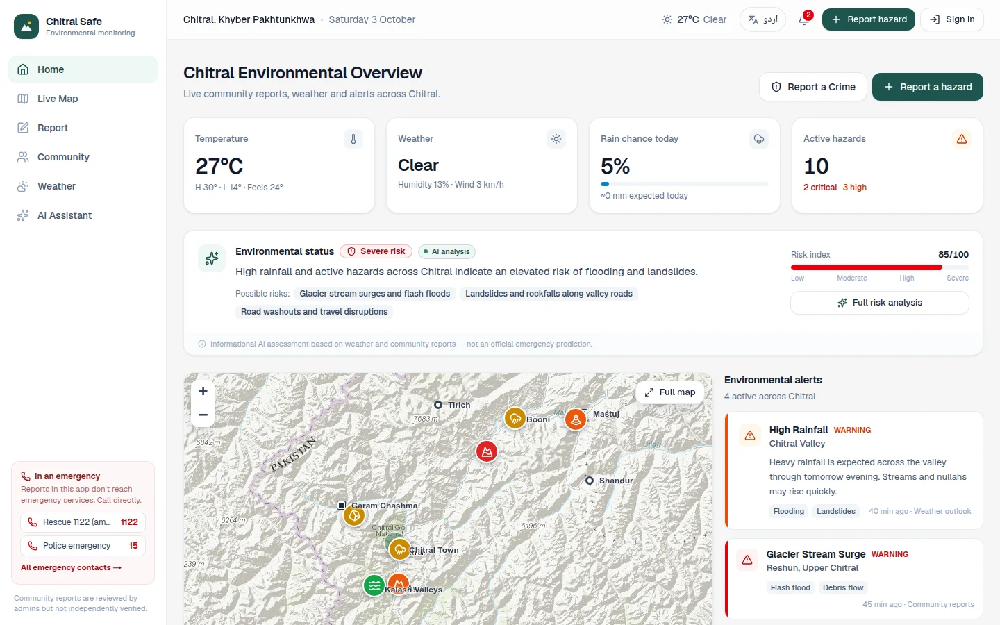

</div>

---

## 📌 Project brief

> **ChitralSafe AI** is an AI-powered community hazard reporting system designed for Chitral. It allows people to report floods, landslides, road blockages, and other hazards by submitting a photo, location, and short description. AI analyzes the reports, identifies possible hazards, prioritizes them, and displays them on an interactive map.

**Try it now:** open the [live demo](https://chitral-safe-ai.vercel.app), choose **Sign in**, and press **User** (to report a hazard) or **Admin** (to review reports). No password is needed for the demo accounts.

---

## 👥 Team

| Name | Role | School | phone no
|---|---|---|
| **Shayan Didar** | Team Lead | Aga Khan Higher Secondary School, Seenlasht |
| **Mubina Izat** | Team Member | Aga Khan Higher Secondary School, Seenlasht |
| **Shah Hamraz Ali Rehmat** | Team Member | Aga Khan Higher Secondary School, Seenlasht |
| **Allina Razaq** | Team Member | Aga Khan Higher Secondary School, Kuragh |
| **Anishka Hussein** | Team Member | Aga Khan Higher Secondary School, Kuragh |

---

## ⚠️ The problem

Chitral sits in the Hindu Kush mountains. Its towns and roads follow narrow river valleys under steep slopes, so **flash floods, glacial lake outburst floods (GLOFs), landslides, rockfall and blocked roads** are part of life, especially during snowmelt, glacier melt and heavy rain.

When something happens, information spreads slowly and unevenly:

- People travelling between villages often **don't know a road is blocked** until they reach it.
- Warnings are passed by word of mouth, and there is **no single place** to see what is happening across the district.
- Weather apps show forecasts that can be **several degrees wrong** in Chitral's deep valleys.
- Many people are more comfortable in **Urdu** than English.

## 💡 Our solution

ChitralSafe AI turns the people of Chitral into a live early-warning network:

1. **Report**: anyone with a phone can report a hazard with a photo, a map pin and a short description.
2. **Verify**: an admin checks every report before it is published, so false or harmful posts never reach the map.
3. **Map**: approved hazards appear on a live map of Chitral, coloured by severity.
4. **Analyze**: AI combines the reports with live weather to give a risk level, possible risks and safety advice for all of Chitral or for one area. People can also ask the assistant questions in English or Urdu.

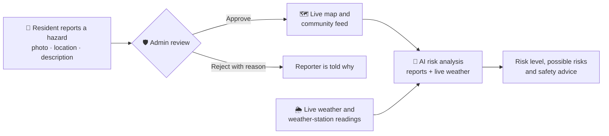

---

## ✨ Features

### 🗺️ Live hazard map
Every approved hazard is shown on a topographic map of Chitral, with markers coloured by severity (Low, Medium, High, Critical). Critical and new reports pulse so they stand out. You can filter by hazard type, severity and place, and jump to 13 main towns, valleys and passes, from Chitral Town and Drosh to Shandur, Broghil and the Kalash Valleys.

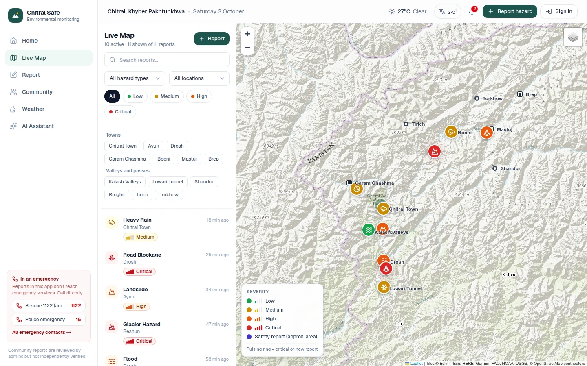

### 🔔 Automatic alerts
Nobody types alerts in by hand. The app creates them from real data: **weather alerts** from the live forecast (heavy rain, a hot day that speeds up glacier melt, snow or frost) and **community alerts** from approved critical and high-severity reports, each linking to its report.

### 📸 Report a hazard in under a minute
Choose the hazard type (flood, landslide, glacier hazard, road blockage, heavy rain, rockfall, snowfall), drop a pin or tap **Use my location**, add up to four photos, describe what you see and pick a severity. A separate **Crime** form lets people report safety incidents publicly or confidentially, with or without their name.

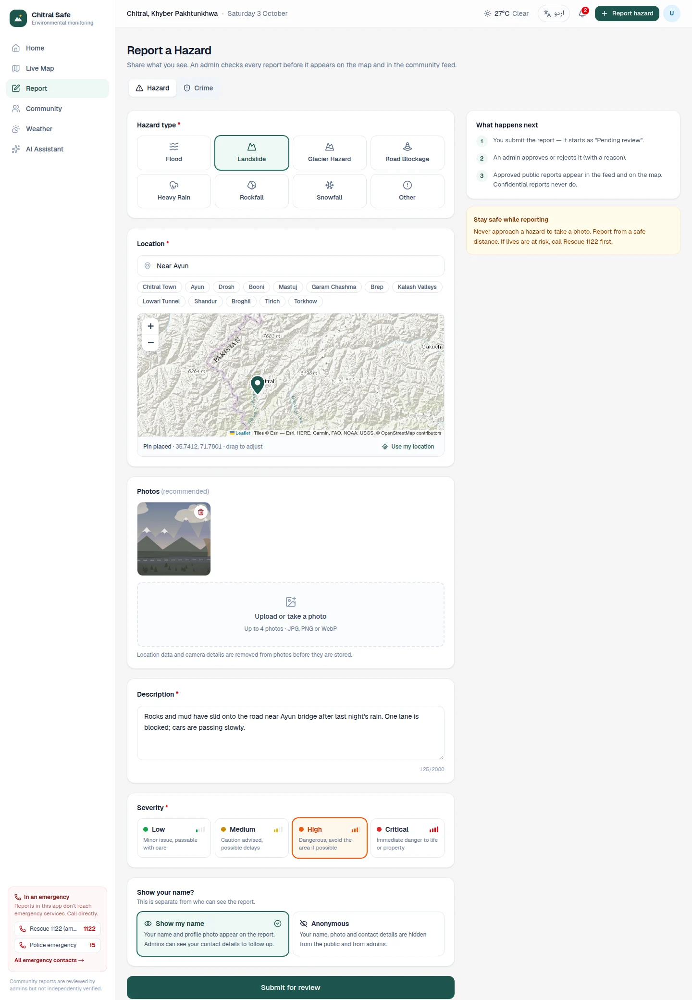

### 🛡️ Admin review before anything goes public
Every report starts as **Pending review**. Admins can approve, reject with a reason, view the report on the map, or delete it. Admins also manage the emergency contact list.

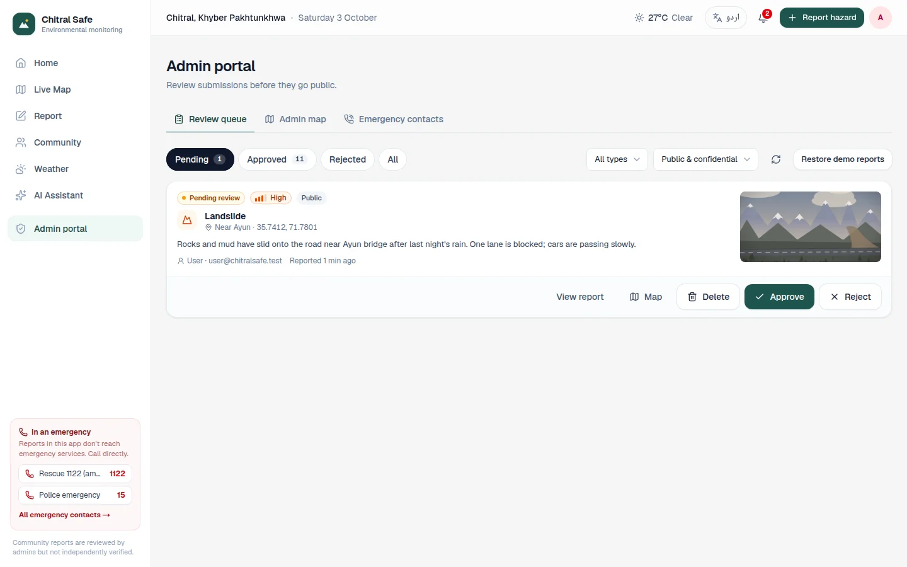

### 🤖 AI assistant and AI risk analysis
The assistant answers questions like *"Is it safe to drive from Chitral Town to Booni today?"* using the **current** weather, alerts and approved reports. The risk analysis gives a risk score from 0 to 100, possible risks, the reasons behind them and a suggested action, for all of Chitral or a single area.

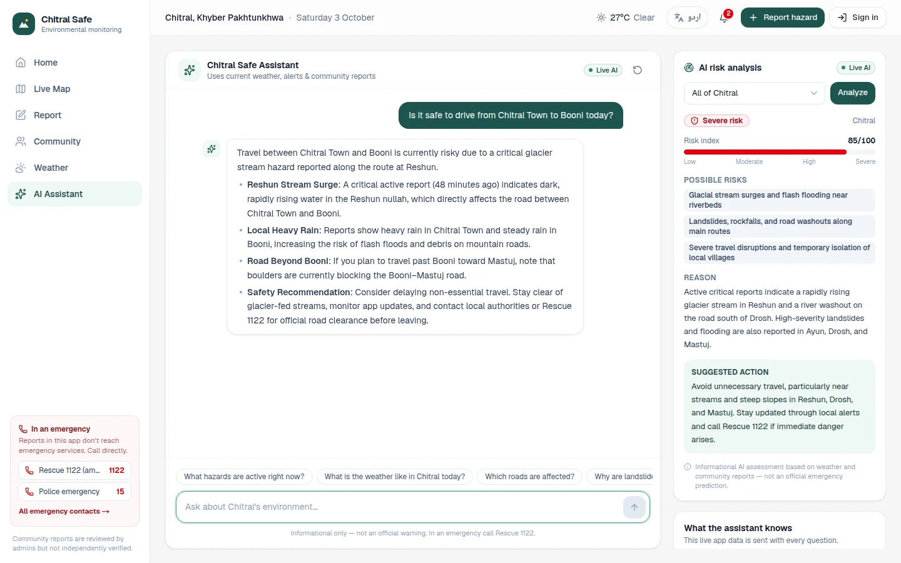

### 🌦️ Real weather, corrected with real measurements
Weather comes from Open-Meteo for every town, valley and pass, with a 24-hour trend and 7-day forecast. Forecast models are often several degrees off in Chitral's deep valleys, so the app also reads the **real measurements from the Pakistan Meteorological Department weather stations in Chitral and Drosh** and corrects the forecast for nearby places. The page always says where the numbers come from.

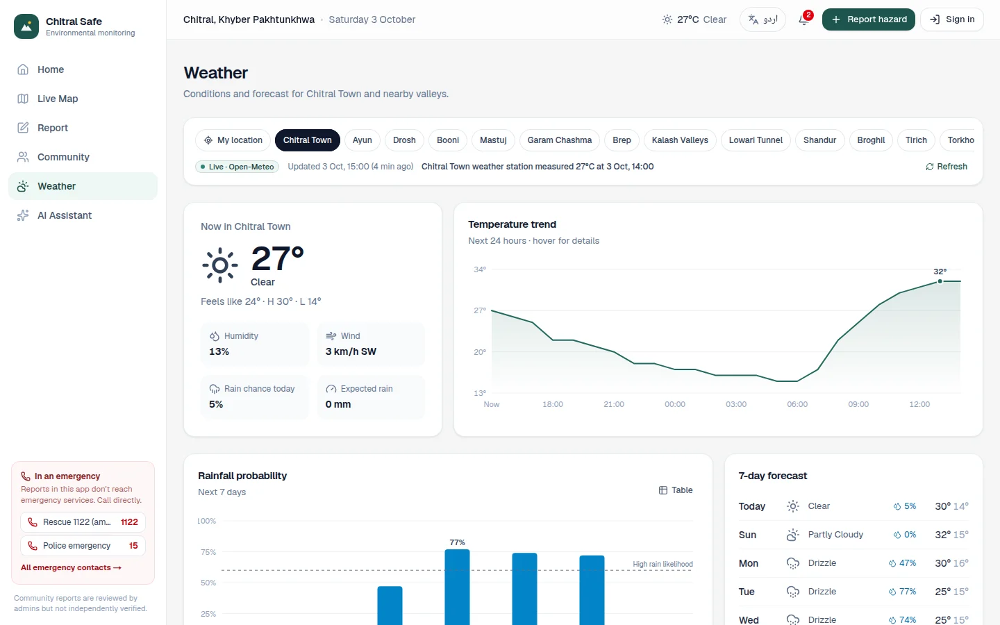

### 👥 Community feed
<table>
<tr>
<td width="50%">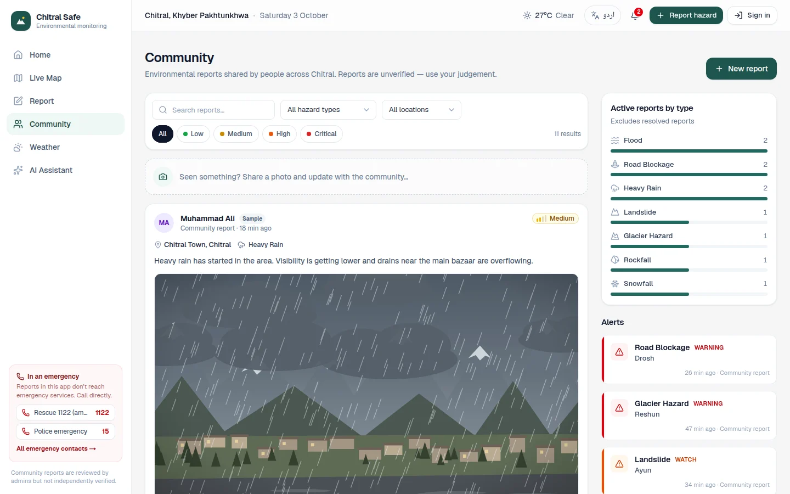</td>
<td width="50%">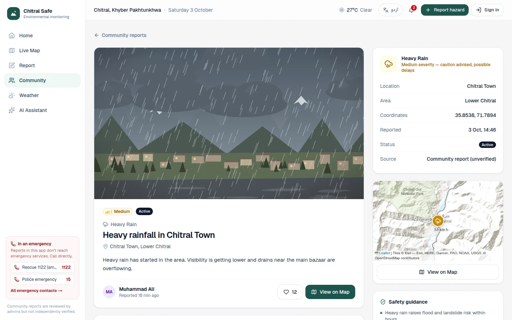</td>
</tr>
<tr>
<td>People can browse, like and comment on approved reports. The demo reports are clearly labelled <b>Sample</b>.</td>
<td>Each report has its photo, exact location, a small map and safety guidance for that hazard type.</td>
</tr>
</table>

### 🇵🇰 Full Urdu support
One tap switches the whole app, including the AI's answers, to Urdu, with a proper right-to-left layout.

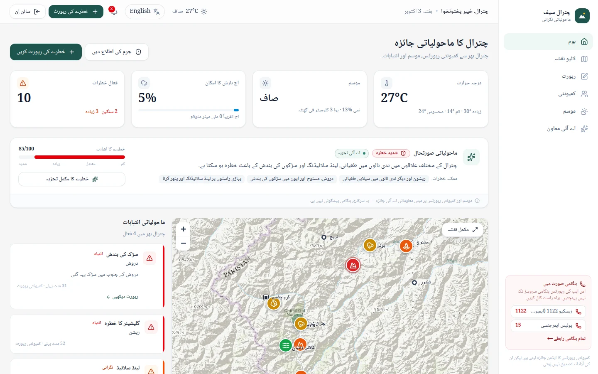

### 📱 Built for phones
Most people in Chitral use the internet on their phones, so every screen works on a small screen, with a bottom navigation bar and a red phone button that opens the emergency contacts.

<table>
<tr>
<td width="33%">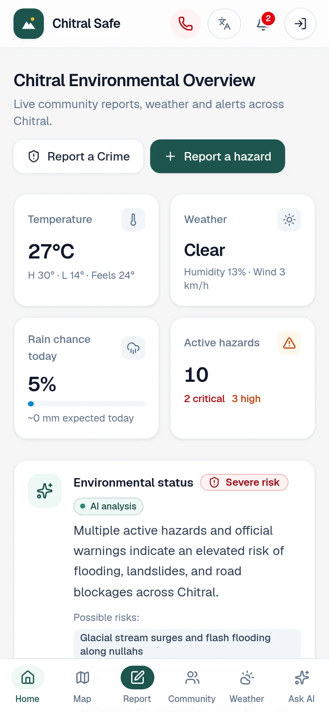</td>
<td width="33%">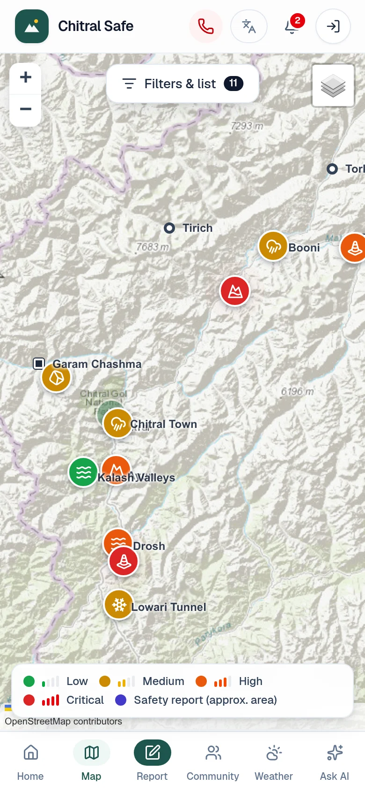</td>
<td width="33%">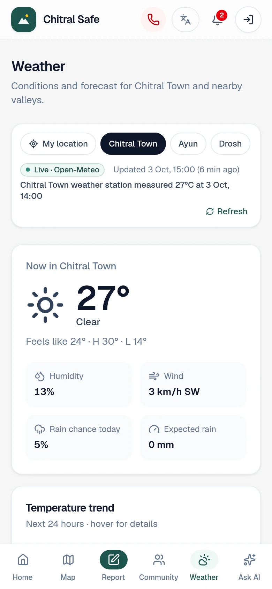</td>
</tr>
</table>

### 📞 Emergency contacts
Rescue 1122 and Police 15 are always close at hand: call links in the sidebar on computers, and one tap away on phones. Admins can add more contacts (phone, SMS or email) after checking them. The app clearly says that submitting a report does **not** contact emergency services.

---

## 🧠 How the AI works

| | What it does | What it uses |
|---|---|---|
| **AI risk analysis** | Gives a risk level (Low to Severe), a 0–100 score, the possible risks, the reason and a suggested action, for all of Chitral or one area | Approved reports (weighted by severity), live weather and rain forecast, active alerts |
| **AI assistant** | Answers questions about hazards, weather, roads and safety, in English or Urdu | The same live app data, sent with every question, plus a knowledge base about Chitral's geography and hazards (`lib/ai/systemPrompt.ts`) |

- Works with **Google Gemini, Anthropic Claude or any OpenAI-compatible model**. If one Gemini model is busy, the app tries the next one automatically.
- **No API key? Still works.** A built-in demo mode gives sensible answers from the same live data, so the app never breaks at an exhibition.
- The AI is clearly labelled as **informational, not an official warning**, and always points to Rescue 1122 for emergencies.
- API keys stay on the server and are never sent to the browser.

---

## 🔒 Privacy and safety by design

- **Nothing is public until an admin approves it.** This stops rumours, mistakes and abuse from reaching the map.
- **Photo GPS data is removed.** Every photo is re-encoded on the server, which strips location and camera details.
- **Crime reports have two separate choices**: who can see the report (public or confidential) and whether your name is shown (named or anonymous).
- **Public crime reports never show the exact spot.** The location is rounded to about 1 km and only the nearest locality is named.
- **"My location" is never saved.** For weather it is rounded to about 1 km.
- Passwords are hashed with scrypt, sessions use secure httpOnly cookies, and every admin action is checked on the server.

<details>
<summary><b>Crime report visibility in detail</b></summary>

| | Named | Anonymous |
|---|---|---|
| **Public** | Shown after approval with the reporter's name | Shown after approval without any name or photo |
| **Confidential** | Only admins and the reporter can see it. Admins can see contact details to follow up. | Only admins and the reporter can see it. The identity is hidden from admins too. |

- Approval never changes visibility: a confidential report stays confidential.
- Report photos are served through an access-checked route, so confidential photos are never publicly reachable.
- **Anonymity limits (explained in the form):** an anonymous report is still linked to the account in the database so the reporter can track and delete it, and anyone with direct database access could see that link. The report's text, photos and location could also identify someone. IP addresses are not stored with reports.

</details>

---

## 🛠️ Tech stack

| Part | Technology |
|---|---|
| Web app | Next.js 16 (App Router), React 19, TypeScript |
| Design | Tailwind CSS v4, right-to-left support for Urdu |
| Map | Leaflet with Esri topographic, street and satellite maps (no key needed) |
| Database | PostgreSQL with Drizzle ORM (embedded PGlite for local development) |
| AI | Google Gemini / Anthropic Claude / OpenAI-compatible, with an offline demo mode |
| Weather | Open-Meteo forecasts + Pakistan Meteorological Department station readings via OGIMET (both free, no key) |
| Photos | sharp (re-encoding and metadata removal) |
| Hosting | Vercel + Neon Postgres |

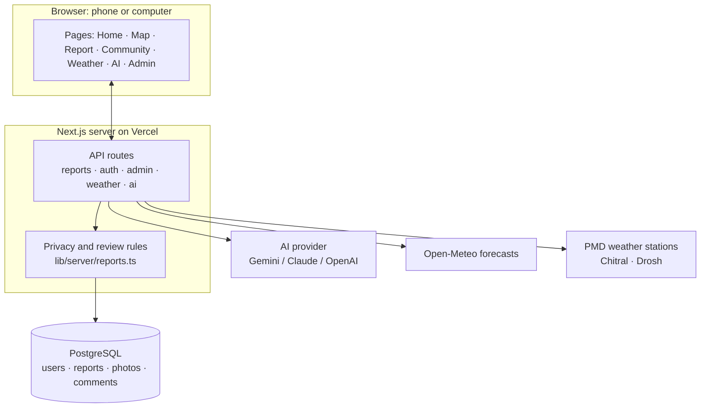

---

## 🚀 Run it yourself

```bash
npm install
npm run dev          # open http://localhost:3000
```

That's all. With no settings, the app uses an embedded database (PGlite, stored in `.data/pglite`), which is created and filled with demo reports on first use. Weather and maps need no API key. The AI uses demo mode until you add a key.

### Demo and admin accounts

The sign-in page has **Admin** and **User** demo buttons (no password; admin@chitralsafe.test and user@chitralsafe.test). They are on by default. **Anyone who opens the site can use them**, so set `DEMO_LOGIN=false` before handling real reports.

For real admins, pick one:

- Set `ADMIN_EMAILS=you@example.com` in `.env.local`, then sign up or sign in with that email.
- Sign up normally, then run `npm run admin:grant -- you@example.com`.

### Environment variables

See `.env.example`. All secrets are read on the server only.

| Variable | Needed | Purpose |
|---|---|---|
| `DATABASE_URL` | **Yes on Vercel** | Postgres connection string (Neon, Supabase, Vercel Postgres…). Leave empty locally to use the embedded database. |
| `ADMIN_EMAILS` | Recommended | Comma-separated emails that become admins. |
| `DEMO_LOGIN` | No | Set to `false` to remove the one-click demo accounts. |
| `SEED_DEMO_DATA` | No | Set to `false` to start with an empty database. |
| `AI_API_KEY` | No | Enables the live AI. Anthropic, Google Gemini and OpenAI-compatible keys are detected automatically. Without it, demo answers are used. |
| `AI_PROVIDER`, `AI_MODEL`, `AI_BASE_URL` | No | Override AI provider details. |
| `WEATHER_PROVIDER` | No | `open-meteo` (default, live, no key) or `demo` (offline sample data). |
| `NEXT_PUBLIC_MAP_TILE_URL` / `_ATTRIBUTION` | No | Custom map tiles. |

### Deploy to Vercel

1. Create a Postgres database. In Vercel: **Storage → Create → Neon** (free tier). This adds `DATABASE_URL` to the project automatically. Any Postgres provider works.
2. Add `ADMIN_EMAILS` (your email) and, optionally, `AI_API_KEY` under **Settings → Environment Variables**.
3. Deploy. `npm run build` runs the database migrations before building, and missing demo reports are added on first start.
4. Sign up with the admin email and open **Admin portal** from the account menu.

Without `DATABASE_URL`, the deployed site still loads (weather, AI and map work), but it shows a banner saying reports are unavailable.

---

## 📂 Project structure

```
app/                  Web pages (each shows a screen from components/) and app/api/ server endpoints
components/<feature>/ Screens grouped by feature: home, map, reports, community, weather, ai, admin…
lib/                  Shared logic: app state, English/Urdu text, AI helpers
lib/server/           Server-only code: database, sign-in, privacy rules, photos, weather, AI
data/                 Places in Chitral and demo reports
drizzle/              Database migrations
docs/screenshots/     The screenshots in this README
```

📖 **[UNDERSTANDING.md](UNDERSTANDING.md)** explains the whole project in plain English: how it was built, how every feature works and where to find the code.

---

## 🔭 What's next

- **AI photo check**: let AI look at each submitted photo, suggest the hazard type and severity, and help admins spot the most urgent reports first.
- **Khowar language**: add Chitral's own language alongside English and Urdu.
- **SMS and offline reporting**: let people in villages with weak internet report by SMS or save a report and send it later.
- **Official alerts**: show warnings from PDMA Khyber Pakhtunkhwa and the Pakistan Meteorological Department directly in the app.
- **Push notifications**: alert people when a critical hazard is approved near them.

---

## 🙏 Acknowledgements

- Weather forecasts by [Open-Meteo](https://open-meteo.com) (free, open data)
- Weather station measurements from the Pakistan Meteorological Department, shared by [OGIMET](https://www.ogimet.com)
- Maps by [Esri](https://www.esri.com), [OpenTopoMap](https://opentopomap.org) and [OpenStreetMap](https://www.openstreetmap.org) contributors, shown with [Leaflet](https://leafletjs.com)

<div align="center">

<br>

**Made with ❤️ for the people of Chitral**

*Community reports are reviewed by admins but not independently verified. In an emergency, call **Rescue 1122**.*

</div>
